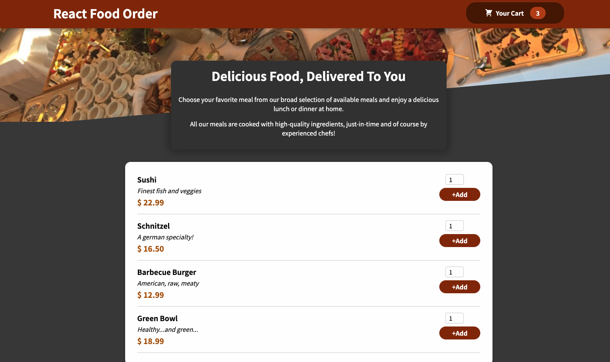

# React-Food-Order-App

Own practicing project

### Using Css Modules

Link: https://create-react-app.dev/docs/adding-a-css-modules-stylesheet/

## React Ui Material

> npm install --save --legacy-peer-deps @material-ui/core

and Material UI installed fine without downgrading npm or React.

## React Portal

Portals provide a first-class way to render children into a DOM node that exists outside the DOM hierarchy of the parent component.

Link: https://reactjs.org/docs/portals.html

> ReactDOM.createPortal(child, container)

## React Hooks

Link: https://reactjs.org/docs/hooks-reference.html

Hooks are a new addition in React 16.8. They let you use state and other React features without writing a class.

THIS PROJECT HAS

<ul>
  <li>useState</li>
  <li>useEffect</li>
  <li>useContext</li>
  <li>useReducer</li>
  <li>useRefs</li>
</ul>

## useContext

> React.createContext();

1- Create a store folder and a file cart-content.js to handle the context
2- Create an object with two functions that will add or remove the items!

> const CartContext = React.createContext({
> items: [],
> totalAmount: 0,
> addItem: (item) => {},
> removeItem: (id) => {},
> });

3- Create a CartProvider.js that will provide the CartContext data to all components in project.

> return <CartContext.Provider>{props.children}</CartContext.Provider>;
> ps: This is a Provider...

## Array.reduce()

link: https://developer.mozilla.org/en-US/docs/Web/JavaScript/Reference/Global_Objects/Array/reduce

> Sintax: Array.reduce((accumulator, currentValue)=>{}, 0)
> Ex:

> const numbers = [1, -1, 2,3];
> const res = number.reduce((accumulator, currentValue) =>{
> return accumulator + currentValue;
> }, 0);

What happens:
1- accumulator = 0, currentValue = 1 => accumulator = 1
2- accumulator = 1, currentValue = -1 => accumulator = 0
3- accumulator = 0, currentValue = 2 => accumulator = 2
4- accumulator = 2, currentValue = 3 => <strong>accumulator = 5</strong>

result= 5
